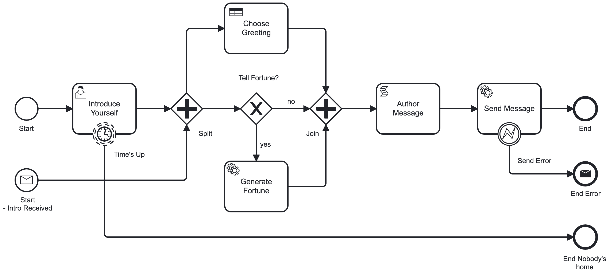

# Spot Flow

Spot Flow is a workflow engine for Rails applications based on the [bpmn](https://www.bpmn.org) standard. It executes business processes defined in a [modeler](https://camunda.com/download/modeler/). It uses [Spot Feel](https://github.com/connectedbits/spot-feel) to evaluate expressions and business rules in the BPMN model. It can be used with [Spot Form](https://github.com/connectedbits/spot-form) to render dynamic forms for user tasks.

## Usage

### Simple Example - Hello World

The engine executes business processes like [this one](/test/fixtures/files/hello_world.bpmn).


To start the process, initialize Spot Flow with the BPMN source, then call `start`.

```ruby
execution = SpotFlow.new(File.read("hello_world.bpmn")).start
```

It's often useful to print the process state to the console.

```ruby
execution.print
```

```ruby
HelloWorld started * Flow_0zlro9p

0 StartEvent Start: completed * out: Flow_0zlro9p
1 ServiceTask SayHello: waiting * in: Flow_0zlro9p
```

The 'HelloWorld' process began at the 'Start' event and is `waiting` at the 'SayHello' task. This is an important concept in the SpotFlow engine. It's designed to be used in a Rails application where a process might be waiting for a user to complete a form, or a background job to complete. It's common to save the state the process until a task is complete. Calling `serialize` on a process will return the execution state so it can be continued later.

```ruby
# Returns a hash of the process state.
execution_state = execution.serialize

# Now we can save the execution state in a database until a user submits a form (UserTask)
# or a background job completes (ServiceTask)

# Restores the process from the execution state.
execution = SpotFlow.restore(File.read("hello_world.bpmn"), execution_state:)

# Now we can continue the process by `signaling` the waiting task.
step = execution.step_by_element_id("SayHello")
step.signal(message: "Hello World!")
```

Now the 'SayHello' task is completed, it's result is merged into the process variables, and the process continues to the 'End' event.

```ruby
HelloWorld completed *

{
  "message": "Hello World!"
}

0 StartEvent Start: completed * out: Flow_0zlro9p
1 ServiceTask SayHello: completed { "message": "Hello World!" } * in: Flow_0zlro9p * out: Flow_1doumjv
2 EndEvent End: completed * in: Flow_1doumjv
```

### Complex Example - Kitchen Sink

The previous example is a simple process with a single task, but BPMN can express more complex workflows like [this one](/test/fixtures/files/kitchen_sink.bpmn).



The example has many elements:

- StartEvent Start: The default start event.
- StartEvent IntroReceived: When a message corresponding to this event is received, the process will start here.
- UserTask IntroduceYourself: A user task that will wait for a person to complete a form.
- IntermediateCatchEvent TimesUp: When the process reaches the user task, the timer will begin. If a user doesn't complete the task in time, the process will continue here.
- ParallelGateway Split: When the process arrives here, it will split into two paths.
- BusinessRuleTask ChooseGreeting: A business rule task that evaluate a decision table to choose a greeting.
- ExclusiveGateway WantsCookie: When the process arrives here, it will choose one of two paths based on whether the user wants a fortune cookie.
- ServiceTask GenerateFortune: A service task that will call a service proc to generate a fortune. Note this will only be called if the expression associated with the path from the exclusive gateway evaluates to true.
- ParallelGateway Join: When the process arrives here, it will wait for both paths to complete.
- ScriptTask AuthorMessage: A script task that will combine the greeting and fortune into a message.
- ServiceTask SayHello: This service task doesn't have an associated service. Instead, it will wait for a signal with a result.
- EndEvent End: The default end event.
- EndEvent SendError: This end event will be used if an error occurs and will send an error message.

To better understand how the engine works, we'll explore two different paths.

#### Scenario 1 - Happy Path

The "Happy Path" is the most common path through a process. It's the path that executes when everything goes right. We must load all sources needed by the workflow. In this case we need both BPMN and DMN sources. When the start method is called, the process will begin at the default start event.

In this example we'll require more than one source. One is a BPMN file that defines the process. The other is a DMN file that defines a decision table used in the business rule task.

```ruby
sources = [File.read("kitchen_sink.bpmn"), File.read("greeting.dmn")]
execution = SpotFlow.new(sources).start
```

The process will begin at the default start event.

#### Scenario 2 - Error Path

In this scenario, we'll explore what happens when something goes wrong. We'll start the process with a message event.

```ruby
execution = SpotFlow.new(sources).start_with_message("IntroductionReceived", { name: "Bob", language: "en", formal: true, cookie: false, error: true })
```

TODO: complete the kitchen sink example.

## Documentation

- [Processes](/docs/processes.md)
- [Tasks](/docs/tasks.md)
- [Events](/docs/events.md)
- [Event Definitions](/docs/event_definitions.md)
- [Gateways](/docs/gateways.md)
- [Expressions](/docs/expressions.md)
- [Data Flow](/docs/data_flow.md)
- [Execution](/docs/execution.md)

## Installation

Execute:

```bash
$ bundle add spot_flow
```

Or install it directly:

```bash
$ gem install spot_flow
```

## Development

```bash
$ git clone ...
$ bin/setup
$ bin/rake
$ bin/guard
```

## License

The gem is available as open source under the terms of the [MIT License](https://opensource.org/licenses/MIT).

Developed by [Connected Bits](http://www.connectedbits.com)
