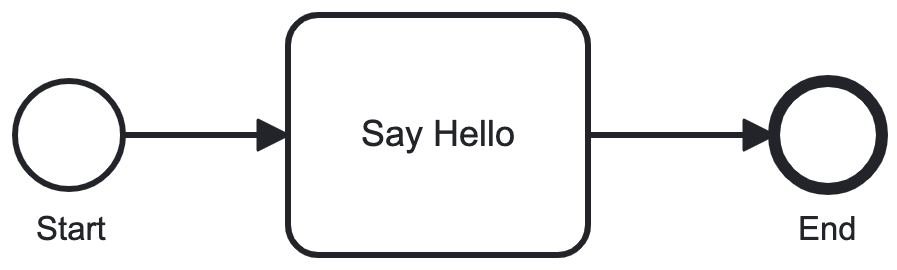

# Spot Flow

Spot Flow is a workflow engine for Rails applications based on the [bpmn](https://www.bpmn.org) standard. It executes business processes defined in a [modeler](https://camunda.com/download/modeler/). It uses [Spot Feel](https://github.com/connectedbits/spot-feel) to evaluate expressions and business rules in the BPMN model. It can be used with [Spot Form](https://github.com/connectedbits/spot-form) to render dynamic forms for user tasks.

## Usage

The engine executes business processes like [this one](/test/fixtures/files/hello_world.bpmn).



Processes are made of a series of tasks. Tasks can be manual (require `signal` to be called) or automated (can be `run` by the engine). The engine supports the following task types:

- Task and UserTask (manual): requires a signal to continue.
- ServiceTask (automated): instantiates a type defined in the task definition and invokes `call` on it.
- BusinessRuleTask (automated): evaluates the decision_id (expects dmn source to be included in the context).
- ScriptTask (automated): evaluates the FEEL expression in the script property.

To start the process, initialize SpotFlow with the BPMN and DMN source files, then call `start`.

```ruby
sources = [
  File.read("hello_world.bpmn"),
  File.read("choose_greeting.dmn")
]
execution = SpotFlow.new(sources).start
```

It's often useful to print the process state to the console.

```ruby
execution.print
```

```ruby
HelloWorld started * Flow_080794y

0 StartEvent Start: completed * out: Flow_080794y
1 UserTask IntroduceYourself: waiting * in: Flow_080794y
2 BoundaryEvent EggTimer: waiting
```

The HelloWorld process began at the Start event and is _waiting_ at the IntroduceYourself user task. This is an important concept in the SpotFlow engine. It's designed to be used in a Rails application where a process might be waiting for a user to complete a form, or a background job to complete. It's common to save the state the process until a task is complete. Calling `serialize` on a process will return the execution state so it can be continued later.

```ruby
# Returns a hash of the process state.
execution_state = execution.serialize

# Now we can save the execution state in a database until a user submits a form (UserTask)
# or a background job completes (ServiceTask)

# Restores the process from the execution state.
execution = SpotFlow.restore(sources, execution_state:)

# Now we can continue the process by `signaling` the waiting task.
step = execution.step_by_element_id("IntroduceYourself")
step.signal(name: "Eric", language: "it", formal: false, cookie: true)
```

After the IntroduceYourself task is _signaled_, the execution continues.

```ruby
HelloWorld started * Flow_0gi9kt6, Flow_0pb7kh6

{
  "name": "Eric",
  "language": "it",
  "formal": false,
  "cookie": true
}

0 StartEvent Start: completed * out: Flow_080794y
1 UserTask IntroduceYourself: completed { "name": "Eric", "language": "it", "formal": false, "cookie": true } * in: Flow_080794y * out: Flow_0t9jhga
2 BoundaryEvent EggTimer: terminated
3 ParallelGateway Split: completed * in: Flow_0t9jhga * out: Flow_0gi9kt6, Flow_0q1vtg3
4 BusinessRuleTask ChooseGreeting: waiting * in: Flow_0gi9kt6
5 ExclusiveGateway WantsCookie: completed * in: Flow_0q1vtg3 * out: Flow_0pb7kh6
6 ServiceTask ChooseFortune: waiting * in: Flow_0pb7kh6
```

When execution reaches the Split inclusive gateway, it forks into two paths. The first path is _waiting_ at the ChooseGreeting business rule task. The second reaches the WantsCookie exclusive gateway and _evaluates_ the sequence flow conditions before continuing to the ChooseFortune service task. Automated tasks can be `run` individually by the engine or `run_automated_tasks` to run all _waiting_ tasks.

```ruby
execution.run_automated_tasks
```

Now, both paths are joined into one and execution is _waiting_ at the script task. Notice, the results of previous tasks are merged into the process variables.

```ruby
HelloWorld started * Flow_0ws7a4m

{
  "name": "Eric",
  "language": "it",
  "formal": false,
  "cookie": true,
  "choose_greeting": {
    "greeting": "Ciao"
  },
  "choose_fortune": "A foolish man listens to his heart. A wise man listens to cookies."
}

0 StartEvent Start: completed * out: Flow_080794y
1 UserTask IntroduceYourself: completed { "name": "Eric", "language": "it", "formal": false, "cookie": true } * in: Flow_080794y * out: Flow_0t9jhga
2 BoundaryEvent EggTimer: terminated
3 ParallelGateway Split: completed * in: Flow_0t9jhga * out: Flow_0gi9kt6, Flow_0q1vtg3
4 BusinessRuleTask ChooseGreeting: completed { "choose_greeting": { "greeting": "Ciao" } } * in: Flow_0gi9kt6 * out: Flow_1652shv
5 ExclusiveGateway WantsCookie: completed * in: Flow_0q1vtg3 * out: Flow_0pb7kh6
6 ServiceTask ChooseFortune: completed { "choose_fortune": "A foolish man listens to his heart. A wise man listens to cookies." } * in: Flow_0pb7kh6 * out: Flow_1iuc1xe
7 ParallelGateway Join: completed * in: Flow_1652shv, Flow_1iuc1xe * out: Flow_0ws7a4m
8 ScriptTask GenerateMessage: waiting * in: Flow_0ws7a4m
```

This time we'll `run` the script task manually.

```ruby
step = execution.step_by_element_id("GenerateMessage")
step.run
```

Now the process is complete.

```ruby
HelloWorld completed *

{
  "name": "Eric",
  "language": "it",
  "formal": false,
  "cookie": true,
  "choose_greeting": {
    "greeting": "Ciao"
  },
  "choose_fortune": "A foolish man listens to his heart. A wise man listens to cookies.",
  "message": "👋 Ciao Eric 🥠 A foolish man listens to his heart. A wise man listens to cookies."
}

0 StartEvent Start: completed * out: Flow_080794y
1 UserTask IntroduceYourself: completed { "name": "Eric", "language": "it", "formal": false, "cookie": true } * in: Flow_080794y * out: Flow_0t9jhga
2 BoundaryEvent EggTimer: terminated
3 ParallelGateway Split: completed * in: Flow_0t9jhga * out: Flow_0gi9kt6, Flow_0q1vtg3
4 BusinessRuleTask ChooseGreeting: completed { "choose_greeting": { "greeting": "Ciao" } } * in: Flow_0gi9kt6 * out: Flow_1652shv
5 ExclusiveGateway WantsCookie: completed * in: Flow_0q1vtg3 * out: Flow_0pb7kh6
6 ServiceTask ChooseFortune: completed { "choose_fortune": "A foolish man listens to his heart. A wise man listens to cookies." } * in: Flow_0pb7kh6 * out: Flow_1iuc1xe
7 ParallelGateway Join: completed * in: Flow_1652shv, Flow_1iuc1xe * out: Flow_0ws7a4m
8 ScriptTask GenerateMessage: completed { "message": "👋 A foolish man listens to his heart. A wise man listens to cookies." } * in: Flow_0ws7a4m * out: Flow_0gkfhvr
9 EndEvent End: completed * in: Flow_0gkfhvr
```

## Documentation

- [Processes](/docs/processes.md)
- [Tasks](/docs/tasks.md)
- [Events](/docs/events.md)
- [Event Definitions](/docs/event_definitions.md)
- [Gateways](/docs/gateways.md)
- [Expressions](/docs/expressions.md)
- [Data Flow](/docs/data_flow.md)
- [Execution](/docs/execution.md)

## Installation

Execute:

```bash
$ bundle add spot_flow
```

Or install it directly:

```bash
$ gem install spot_flow
```

## Development

```bash
$ git clone ...
$ bin/setup
$ bin/rake
$ bin/guard
```

## License

The gem is available as open source under the terms of the [MIT License](https://opensource.org/licenses/MIT).

Developed by [Connected Bits](http://www.connectedbits.com)
